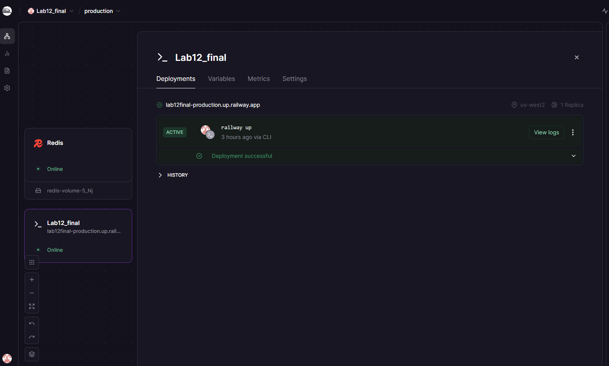
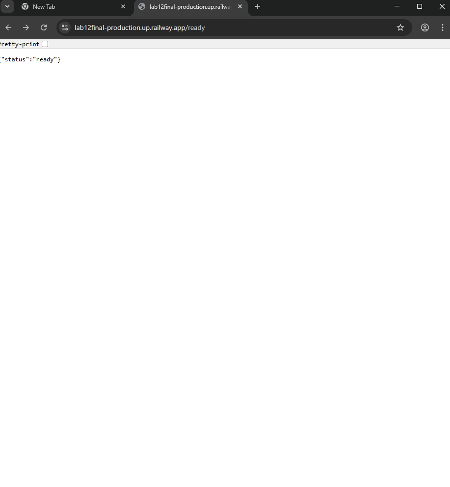
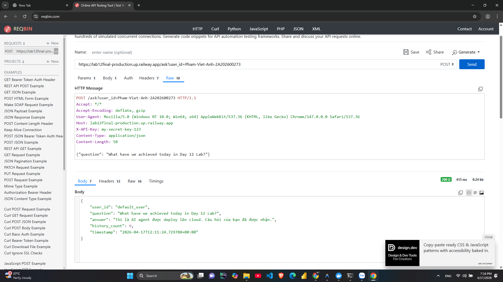

# Deployment Information

## Public URL
https://lab12final-production.up.railway.app

## Platform
Railway

## Test Commands

### Health Check
```bash
curl https://lab12final-production.up.railway.app/health
# Expected: {"status": "ok", ...}
```

### Readiness Check
```bash
curl https://lab12final-production.up.railway.app/ready
# Expected: {"status": "ready"}
```

### API Test (with authentication)
```bash
curl -X POST https://lab12final-production.up.railway.app/ask \
  -H "X-API-Key: my-secret-key-123" \
  -H "Content-Type: application/json" \
  -d '{"question": "Hello Agent!"}'
```
## Screenshots
- 
- 
- 
- 


## Environment Variables Set
- PORT: 8080 (Railway dynamic)
- REDIS_URL: Kết nối tới Redis Cloud
- AGENT_API_KEY: my-secret-key-123
- LOG_LEVEL: INFO
